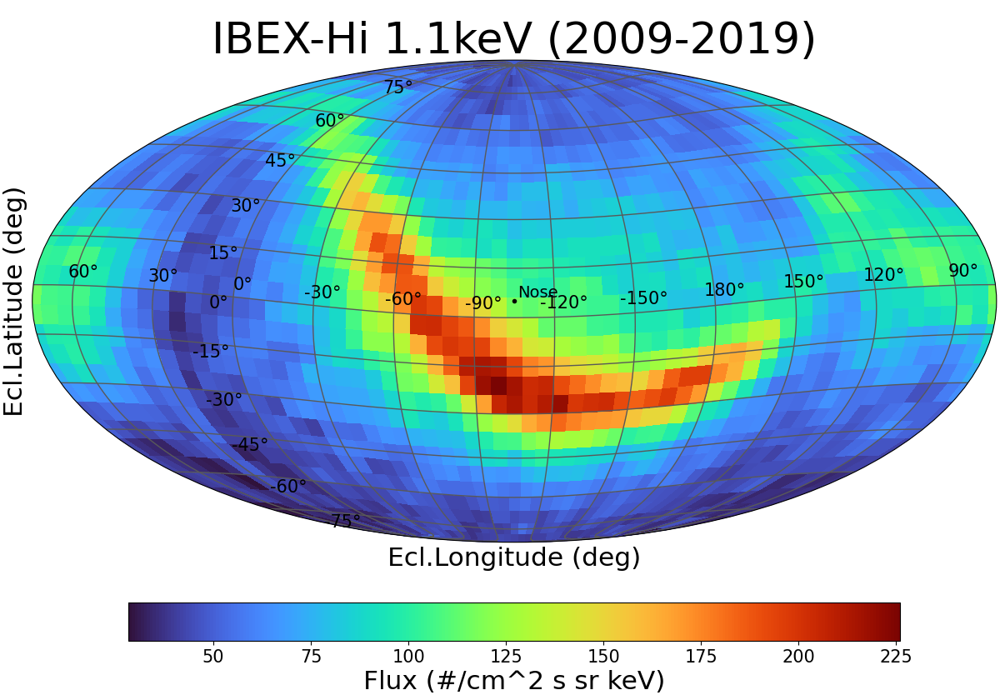
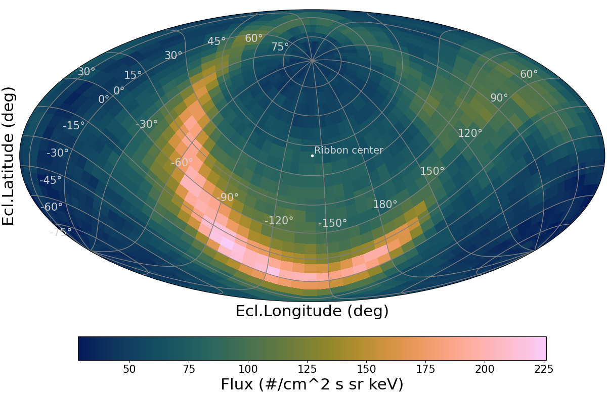
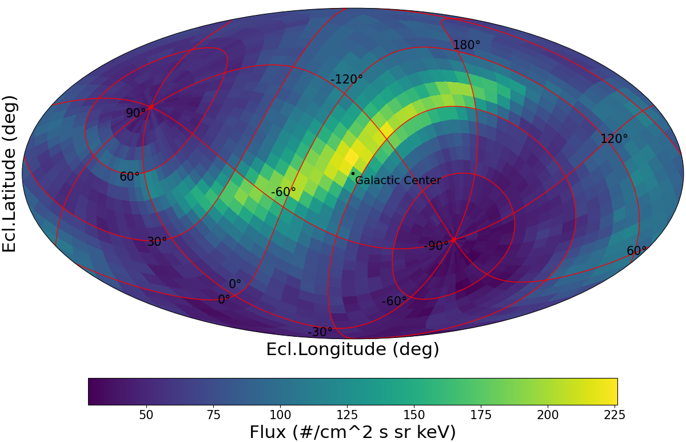

# Mollpy SkyMaps

[](https://github.com/jgazer/mollpy-skymaps/releases)
[](https://github.com/jgazer/mollpy-skymaps/blob/main/LICENSE)
[](https://www.python.org/)

A Python Package for plotting all-sky maps in Mollweide projection with arbitrary map orientation.

### Author

Jonathan Gasser, Southwest Research Institute, San Antonio, TX, USA.<br>
Contact: *jonathan.gasser_at_swri<span>.org*</span><br>
@jgazer<br>
Version: v1.0 (October 30, 2025)

---

## Overview

**Mollpy-SkyMaps** is a Python package for creating all-sky maps from 2D imaging data in celestial coordinates in any **custom map orientation**.
The maps are plotted using *matplotlib.pyplot* in the standard **Mollweide projection**.
While initially intended for visualizing Energetic Neutral Atoms (ENA) flux maps, the tool is applicable to any celestial dataset available in 2D binned coordinates (e.g., longitude, latitude) and corresponding values.
For example, this allows to view celestial images maps given in ecliptic coordinates to be plotted in different celestial coordinate systems without having to reprocess (rebinning) the dataset itself.
This is based on the ***matplotlib.pyplot*** package.

### Features

- Plotting all-sky maps of 2D image data in Python in Mollweide projection.
- Included coordinate rotations necessary for **arbitrary map view orientations**.
- Applies the Astronomical or **Celestial Longitude convention**: right-to-left longitude coordinates, inside-out view of the sky.
- Uses *matplotlib.pyplot* for seamless integration into Python visualization workflows.
- Data can be any direction-dependent 2D mappable data such as flux, intensity, temperature, densities, potentials, brightness, ...
- Data coordinates can be in any spherical coordinate system (e.g., Ecliptic coordinates).
- No recalculation of image data needed.
- Data coverage: Full-sky or only for some regions of the celestial sphere. Data gaps are also accepted.
- Other map projections may be supported as well: *matplotlib.projections.geo* *'hammer'* and *'aitoff'* projections work, whereas *'lambert'* creates issues.

### Limitations and Future Plans

[TODO]


## Getting Started

### Installation

To use the package, clone this repository and ensure all dependencies are installed. The project is compatible with **Python 3.7+**. Earlier versions of Python may work as well but are not checked.

```bash
# Clone the repository
git clone https://github.com/jgazer/mollpy-skymaps.git
cd mollpy-skymaps

# Install dependencies (if not already installed)
pip install -r requirements.txt
```

### Quick Start

The routine `map_rotated.py` can be called directly to show a default Mollweide map (see Example 1 below).<br>
In your file explorer, go to the directory "mollpy-skymaps" and open file `map_rotated.py`. Or from command line:

```bash
cd mollpy-skymaps
map_rotated.py
```

A **minimal example** is given in file `run_map_rotated.py`. Open this file in your favorite editor.
- Adjust the three rotation angles `alfa`, `phi`, `theta` to any values.
- Adjust the `filename` to a file in the *Examples* subfolder. To load and plot your own formatted datafile, pass its filename and its directory path to the `load_data()` function:<br>
```bash
 lons, lats, data = load_data( <your_filename>, path= <your_path> )
```
- Alternatively, comment the line with `load_data()` and uncomment the lines defining `lons`, `lats`, `data`.
- Save and run the routine `run_map_rotated.py`.

For more options and details on customizing the plot, see the [Manual](manual.md).


## Examples

**Example 1**:<br>
All-sky map of ENA flux at 1.1keV as measured by IBEX-Hi (energy bin 3) over a full solar cycle (2009-2019). The data file is from the [IBEX Data Release 18](https://ibex.princeton.edu/DataRelease) \[1\].
The map is oriented with the center in the heliospheric upwind (Nose) direction, and is shown in the colormap *'turbo'*.<br>



**Example 2**:<br>
The same data as in Example 1 are shown, but the map is oriented to the center of the IBEX ribbon. It is shown in a [scientific color palette](https://www.fabiocrameri.ch/colourmaps/), *'batlow'*,
as defined in the Python package *['cmcrameri.cm'](https://pypi.org/project/cmcrameri/)* \[2\]. The coordinate grid still shows ecliptic coordinates.<br>



**Example 3**:<br>
Same data as in Example 1, but the map is in galactic orientation (North Galactic Pole on top; centered on the Galactic Center), with *'viridis'* color palette and customized coordinate grid (ecliptic coordinates).
For more plot customization options see the [Manual](manual.md).



**References**:<br>
\[1\] D.J. McComas et al., *Fourteen Years of Energetic Neutral Atom Observations from IBEX*, ApJS 270:17 (2024). **doi**: [10.3847/1538-4365/ad0a69](https://doi.org/10.3847/1538-4365/ad0a69)<br>
\[2\] F. Crameri et al., *The misuse of colour in science communication*, Nature Comm. 11, 5444 (2020). **doi**: [10.1038/s41467-020-19160-7](https://doi.org/10.1038/s41467-020-19160-7)

## File Descriptions

| **File**               | **Description**                                                                                           |
|-------------------------|-----------------------------------------------------------------------------------------------------------|
| `run_map_rotated.py`    | Quickstart script that loads sample data and generates a Mollweide map.                                   |
| `map_rotated.py`        | Core module containing functions for coordinate rotation, Mollweide map creation, and customization.     |
| `sphere_rotate.py`      | Helper functions for spherical coordinate transformations and rotations.                                 |
| `config.json`           | Configuration file containing data paths and preset coordinate system information.                       |
| `data_io.py`            | Utility functions for loading map data.                                                                 |

For more detailed documentation, we refer to the included *docstrings* and to the [Manual](manual.md).

## References

Plots and graphics made with this python tool contributed to the following publications:
- A. Galli et al., *15 yr of Interstellar Neutral Hydrogen Observed with the Interstellar Boundary Explorer*, ApJS 278:1 (2025). **doi**: [10.3847/1538-4365/adc451](https://doi.org/10.3847/1538-4365/adc451)
- J.M. Sokół et al., *Evolution of Large-scale Structures in the Energetic Neutral Atom Sky Maps in Energy and Solar Activity*, ApJ 992:168 (2025). **doi**: [10.3847/1538-4357/adfa24](https://doi.org/10.3847/1538-4357/adfa24)

## Contributing

Contributions are welcome! If you encounter any bugs, or have suggestions for improvement, feel free to open an issue in the [Issues](https://github.com/jgazer/mollpy-skymaps/issues) section. For feature requests or improvements, submit a pull request with your proposed changes.

## Acknowledgments

Contributing Coauthors:
- Justyna M. Sokół (*Southwest Research Institute, San Antonio TX, USA*)
- Maher A. Dayeh (*Southwest Research Institute, San Antonio TX, USA*)
- Nicholas Gross (*Boston University, Boston MA, USA*)

This tool was developed for visualizing Energetic Neutral Atoms (ENA) all-sky maps in custom-orientation Mollweide projection. It leverages open-source tools including **Matplotlib** and **NumPy** for computation and visualization. This tool was implemented as part of a research project in [SHIELD](https://shielddrivecenter.com/). We acknowledge the support of **NASA grant 18-DRIVE18_2-0029, Our Heliospheric Shield, 80NSSC22M0164**.

## License

This project is licensed under the [MIT License](https://github.com/jgazer/mollpy-skymaps/blob/main/LICENSE). You are free to use, modify, and distribute this software under the terms of the license.

